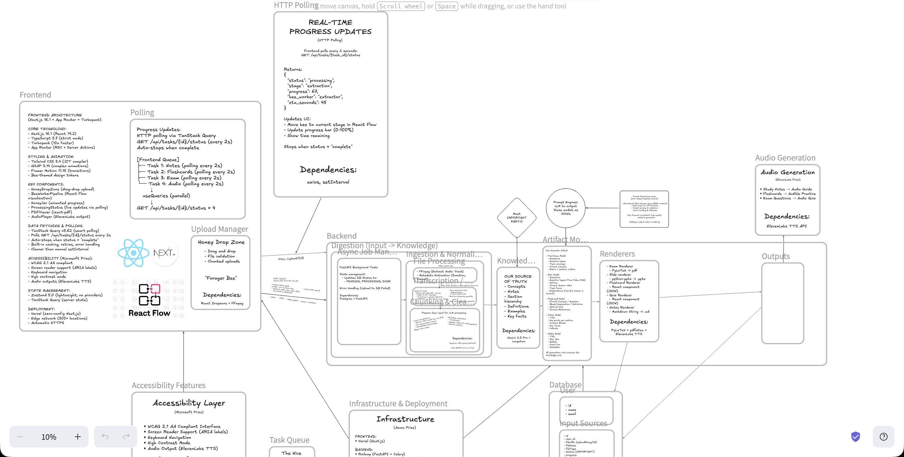
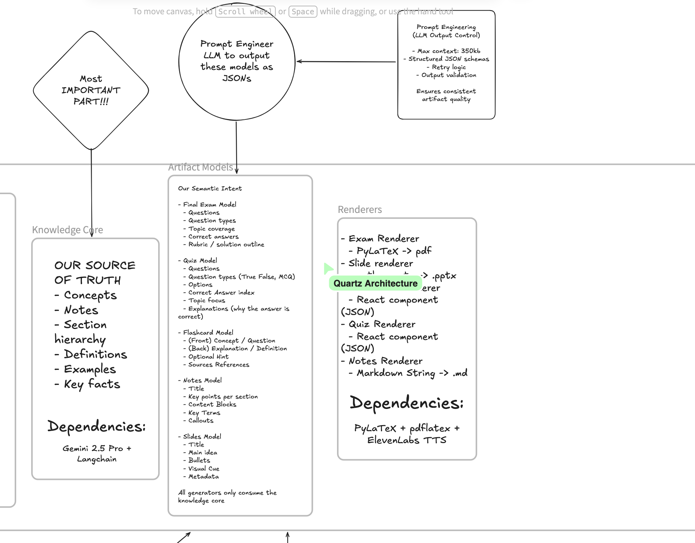
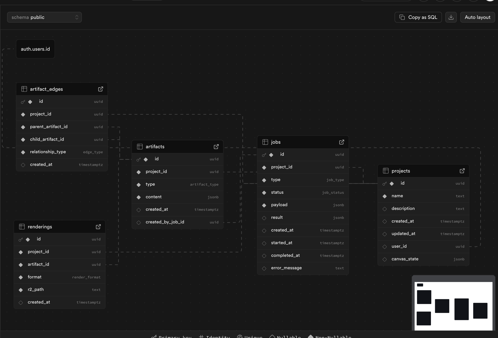

<div align="center">
  
  
  # BeePrepared
  
  **Transform lectures into study materials in under three minutes**
  
  [](https://nextjs.org/)
  [](https://react.dev/)
  [](https://fastapi.tiangolo.com/)
  [](https://supabase.com/)
  
  [Demo Video](https://www.youtube.com/watch?v=S2ZwaheHSiY) · [Devpost](https://devpost.com/software/beeprepared) · [Report Bug](https://github.com/SquaredPiano/beeprepared/issues)
</div>

---

## 🎬 Demo

<div align="center">
  <video src="frontend/public/BePreparedMP4.mp4" controls width="100%" poster="frontend/public/gallery.jpg">
    <a href="frontend/public/BePreparedMP4.mp4">Watch local demo video</a>
  </video>
  <p><em>Turn a 2-hour lecture into a complete study pack in seconds.</em></p>
</div>

---

## ✨ Overview

BeePrepared is an **AI-native learning platform** that ingests raw lecture content and outputs structured study artifacts. It uses a graph-based "Knowledge Core" to ensure consistency across generated materials.

> *"Upload a lecture, get a study guide."* — Simple as that.

<div align="center">
  
</div>

### Features

| Feature | Description |
|---------|-------------|
| 🧠 **Knowledge Core** | AI extracts concepts and relationships into a graph, acting as a single source of truth. |
| 📹 **Universal Ingest** | Upload MP4, MP3, PDF, PPTX, or YouTube URLs. We handle the transcription and OCR. |
| 🎨 **Canvas Workflow** | Infinite canvas to organize, connect, and generate study nodes (Quizzes, Flashcards, Notes). |
| ⚡ **Deepgram Nova-2** | Lightning-fast transcription with high accuracy for technical terms. |
| 🔄 **Node Chaining** | Generate artifacts from other artifacts (e.g., Flashcards *derived from* a Quiz). |

---

## 📸 Gallery

<div align="center" style="display: grid; grid-template-columns: 1fr 1fr; gap: 10px;">
  
  
  
  
</div>

---

## 🚀 Setup & Deployment

**The only requirement is Docker Desktop.**

We strongly recommend using Docker to ensure all system dependencies (FFmpeg, LaTeX for PDFs, etc.) are correctly installed without polluting your host machine.

### Quick Start

1. **Clone & Config**
   ```bash
   git clone https://github.com/SquaredPiano/beeprepared.git
   cd beeprepared
   cp .env.example .env
   # Add your API keys to .env
   ```

2. **Run**
   ```bash
   docker-compose up --build
   ```

3. **Visit**
   - App: [http://localhost:3000](http://localhost:3000)
   - API Health: [http://localhost:8000/health](http://localhost:8000/health)

📄 **[Read the Full Setup Guide](./docs/SETUP_GUIDE.md)** for detailed troubleshooting and verification steps.

---

## 🛠️ Architecture

BPP (BeePrepared Platform) uses a **Generator-Node** architecture.

```
[Ingest] -> [Transcription] -> [Knowledge Core Extraction]
                                        ↓
[Canvas UI] -> [Node Graph] -> [Artifact Generation (LLM)]
```

- **Frontend**: Next.js 16 (App Router), React Flow, Tailwind 4, Zustand.
- **Backend**: FastAPI, Pydantic, Supabase (pgvector + jsonb).
- **AI**: Gemini 2.5 Pro (Reasoning), Deepgram Nova-2 (Audio).
- **Core Dependencies**: FFmpeg (Media), TeXLive (PDFs), Cloudflare R2 (Storage).

---

## 🤝 Contributing

We welcome contributions! Please fork the repo and submit a PR.

---

<div align="center">
  <sub>SquaredPiano × BeePrepared</sub>
</div>
